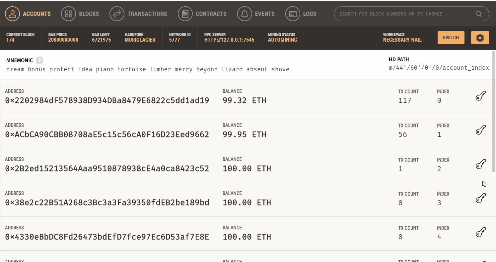

  

## IMSToken
It is a ERC-20 Token. ERC-20 is a standard for fungible tokens in ethereum blockchain. Fungible means each token is exactly the same as any other token.
IMSToken is redeemed when users buy and get receipt from the stores that has deployed IMS Software. Once deployed to Main Ethereum network it can have actual value.
The token is simple enough and doesn't promise anything extra functional or innovative. Currently it is functioning  only as a reward points. But this can be much more than that.

## Technology Used
- React : JS library for frontend
- Truffle: Development environment for Ethereum Virtual Machines
- Tailwind : CSS Framework 
- Web3 : Ethereum Javascript API

## Steps to run

- `$ npm i`
- `$ npm i -g truffle`
- `$ truffle migrate`
- `$ npm run start`

## IMS Customer Frontend 
- Users can view what they bought by typing in UID
- Users can redeem the tokens based on total purchase price. 
## Demo

### This is one of the repo that constitutes our Semester Project
Members:
- Adarsha Dhakal 
- Sujit KC
- Anurag Timilsina
- Ayush Paudel
- Ashish Thapa
